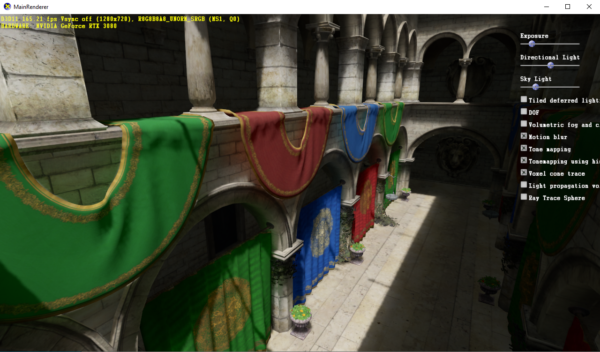
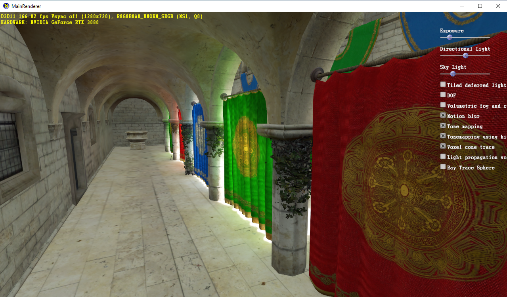
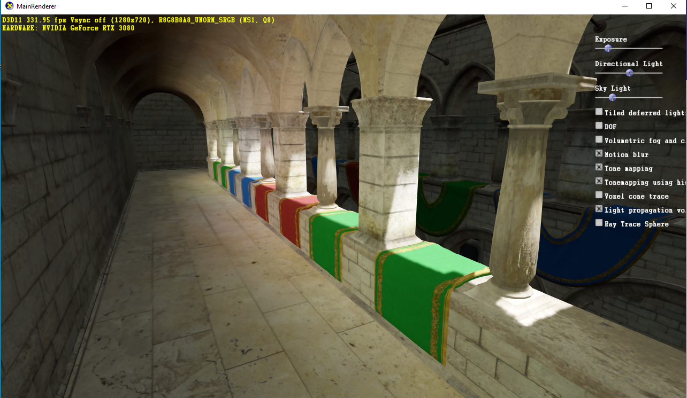
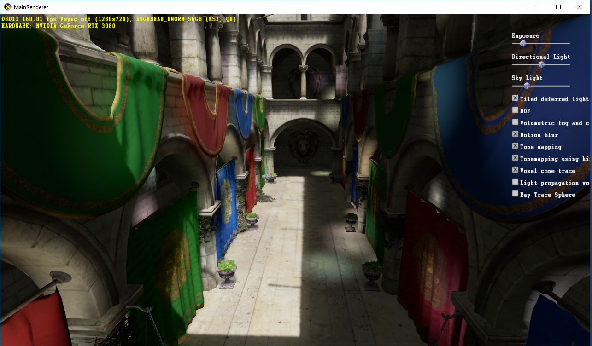
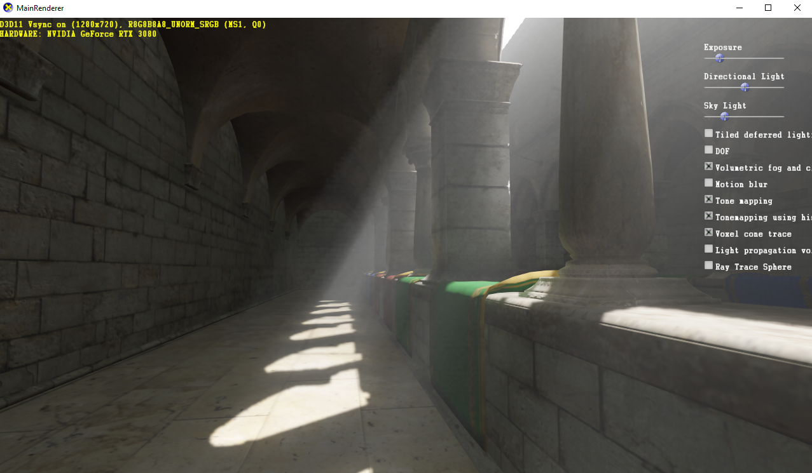
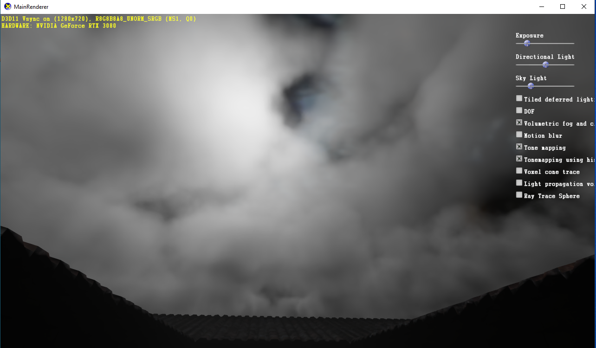
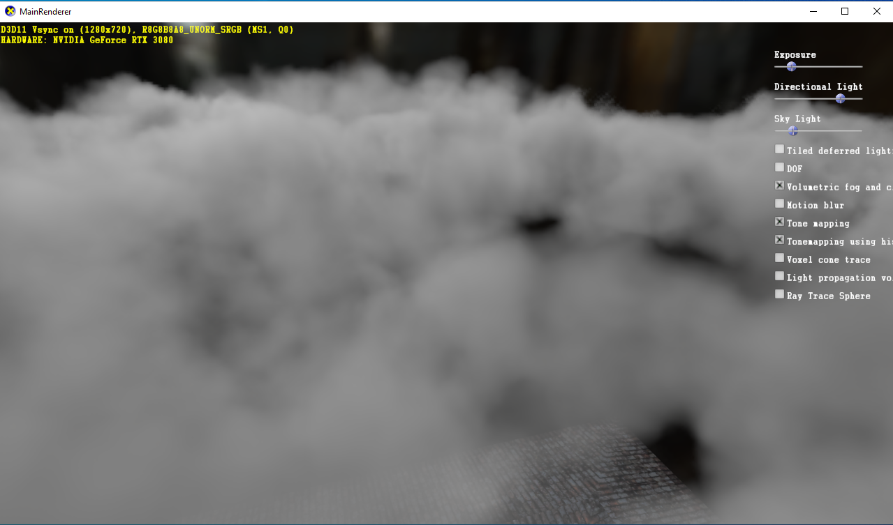
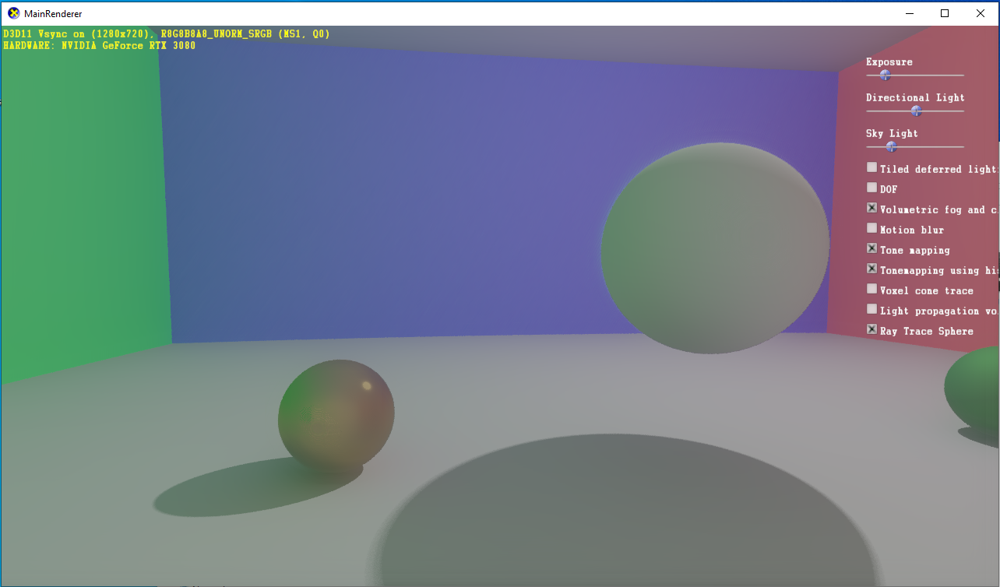

# Dx11 renderer 
This is the result of trying out and implementing different graphics techniques.  
Feature include:  
Physically based shading  
Tiled deferred rendering  
Cascade shadow mapping  
Voxel cone trace  
Light propagation volume  
Image based lighting  
Volumetric fog and cloud  
TemporalAA  
Ambient occlusion  
motion blur  
DOF  
Histogram based tone mapping  
Ray tracer for spheres  

